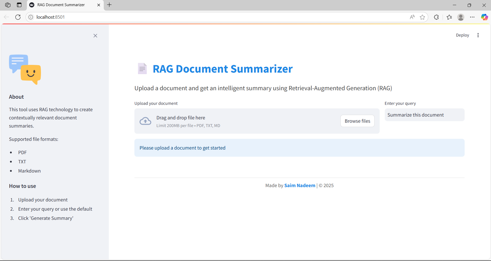
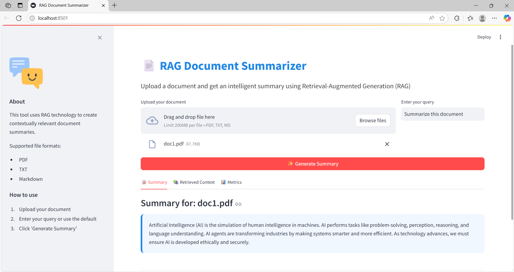
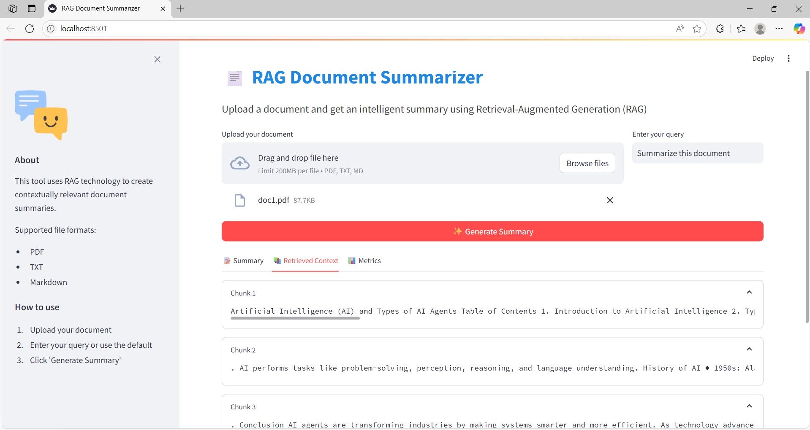
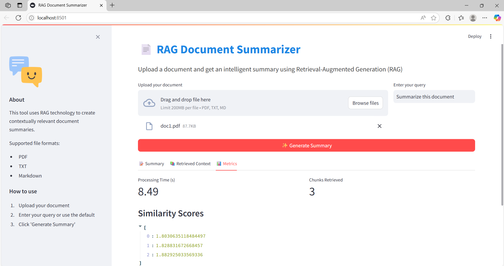

📄 RAG Document Summarizer (PDF, TXT, MD)

[](https://www.python.org/)
[](https://github.com/facebookresearch/faiss)
[](https://streamlit.io)
[](https://huggingface.co/facebook/bart-large-cnn)
[](LICENSE)

An AI-powered Retrieval-Augmented Generation (RAG) app that summarizes documents by chunking input files, embedding them, retrieving contextually relevant sections, and generating a final summary using a pre-trained large language model.

---

## 🧠 Key Features

- ✂️ Chunk-based document splitting (Recursive strategy)
- 📐 Embedding using `sentence-transformers` (MiniLM)
- 🔍 Fast similarity search via FAISS
- 🤖 LLM Summarization using `facebook/bart-large-cnn`
- 📄 Supports `.pdf`, `.txt`, and `.md` documents
- 🖥️ Elegant Streamlit UI with tabs for summary, context, and metrics

---

## 🗂️ Project Structure

```
├── RAGSummarizer.py               # Backend RAG logic
├── rag_summarizer_app.py         # Streamlit GUI
├── requirements.txt              # All Python dependencies
├── doc1.pdf                      # Sample PDF 1
├── doc2.pdf                      # Sample PDF 2
├── doc3.pdf                      # Sample PDF 3
├── images/
│   ├── img1.png                  # Main UI
│   ├── img2.png                  # Summary tab
│   ├── img3.png                  # Retrieved context
│   └── img4.png                  # Metrics
└── README.md                     # You are here
```

---

## ▶️ How to Run the App

### 🔁 Clone the Repository

You can clone this project from GitHub using:

```bash
git clone https://github.com/Saim-Nadeem/rag-document-summarizer.git
cd rag-document-summarizer
```

### 1️⃣ Install Dependencies

```bash
pip install -r requirements.txt
```

### 2️⃣ Launch the App

```bash
streamlit run rag_summarizer_app.py
```

### 3️⃣ Use in Browser

- Upload a `.pdf`, `.txt`, or `.md` file  
- Optionally change the query (default: *"Summarize this document"*)  
- Click **"✨ Generate Summary"**

---

## 🧪 Demo

### 🔹 Step 1: Upload & Query


### 🔹 Step 2: Generated Summary


### 🔹 Step 3: Retrieved Chunks


### 🔹 Step 4: Latency & Similarity


---

## 🔧 Under the Hood

- **Text Splitting**: `RecursiveCharacterTextSplitter`
- **Embedding**: `all-MiniLM-L6-v2` from Sentence Transformers
- **Similarity Search**: FAISS index (L2 distance)
- **Summarization**: `facebook/bart-large-cnn` via HuggingFace Transformers

---

## 📌 Example Query

> "Summarize this document"

Can be changed to:
- "What are the key takeaways?"
- "Summarize the financial section"

---

## 📦 Requirements

- Python 
- Transformers
- SentenceTransformers
- FAISS
- PyPDF2
- Streamlit

Install all using:

```bash
pip install -r requirements.txt
```

---

## 🔐 License

This project is licensed under the **MIT License**.  
See the [LICENSE](LICENSE) file for more information.

---

## 👤 Author

**Saim Nadeem**  
🔗 GitHub: [Saim-Nadeem](https://github.com/Saim-Nadeem)

---
